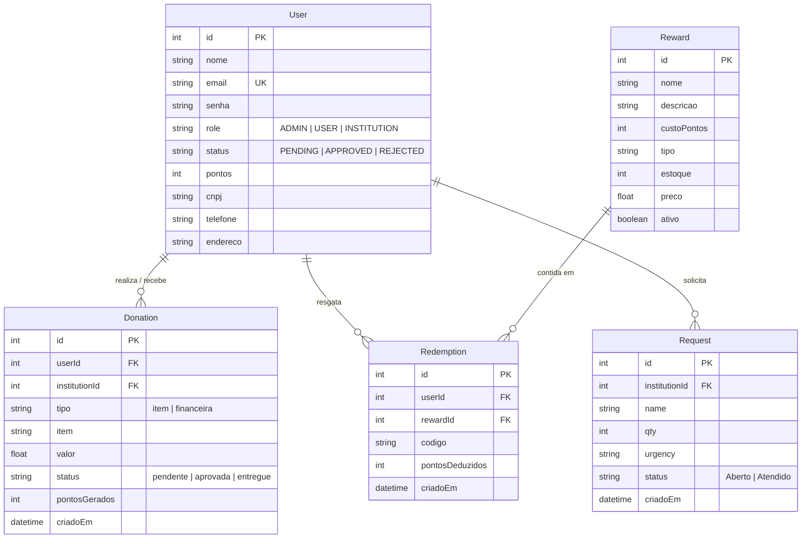

# 🗄️ Modelo de Dados — ConectaBem

O ConectaBem utiliza um banco de dados relacional (PostgreSQL) gerenciado pelo Prisma ORM. Abaixo está a representação visual e técnica do esquema.

---

## 📊 Diagrama de Entidade-Relacionamento (ER)

---

## 📝 Descrição das Tabelas

### `users`
Armazena todos os perfis do sistema. A diferenciação de permissões é feita pelo campo `role`. O campo `pontos` é o saldo atual do doador.

### `donations`
Registra toda movimentação de entrada (doações) e saída (saques).
- Se `valor` > 0: É uma doação recebida.
- Se `valor` < 0: É um saque realizado pela ONG.

### `requests`
Lista de necessidades cadastradas pelas ONGs para sensibilizar doadores.

### `rewards`
Catálogo de itens (Gift Cards, vouchers) que podem ser trocados por pontos.

### `redemptions`
Histórico de trocas realizadas. Cada registro gera um código único que o usuário utiliza para resgatar sua recompensa.

---

  <b>ConectaBem — Schema v1.2.0</b>

